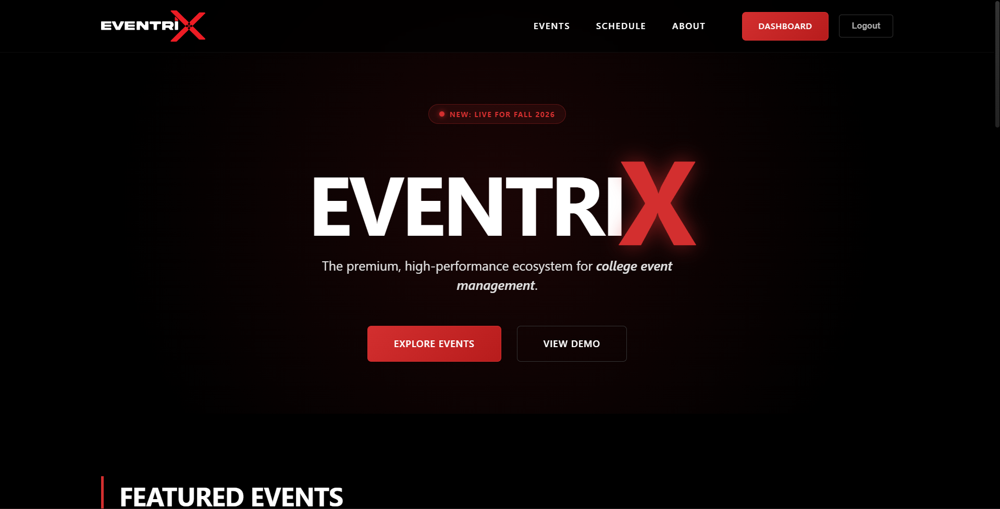
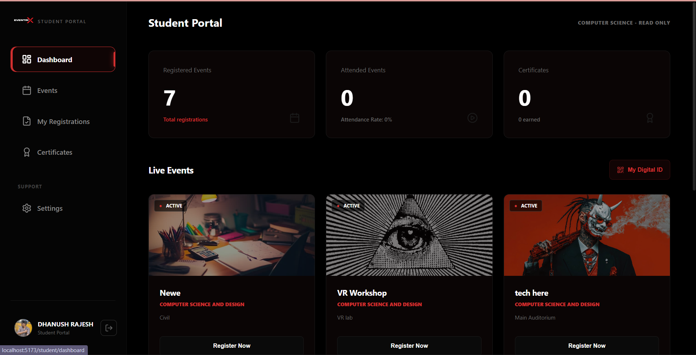
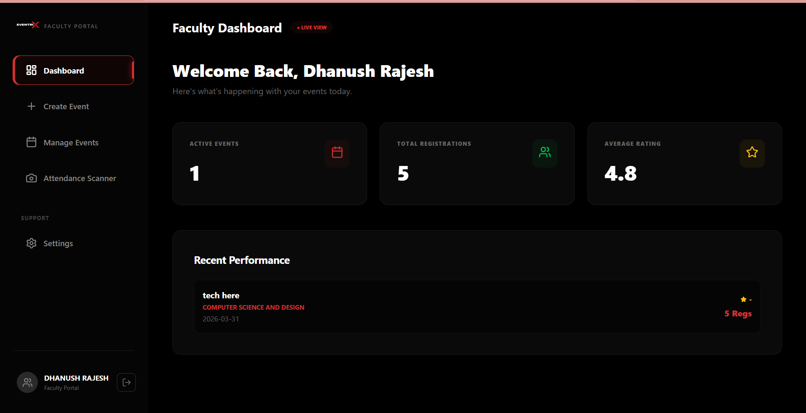
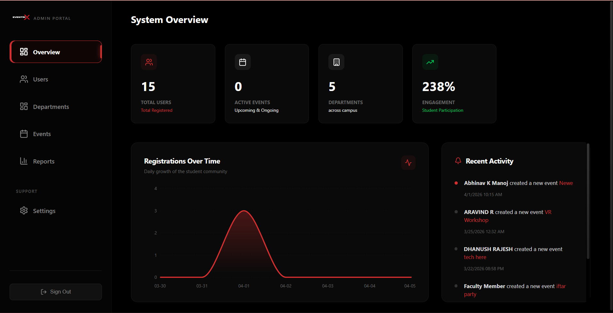

# Eventrix - Modern Event Management System

Eventrix is a comprehensive platform designed to streamline institutional event management. It provides a seamless experience for students to discover and register for events, while offering faculty members powerful tools for event creation and real-time attendance tracking.



## Core Modules

### 🎓 Student Portal
Designed for effortless event discovery and participation.



- **Event Discovery**: Browse through a curated list of technical, cultural, and academic events.
- **QR Entry Pass**: Instant generation of digital tickets for seamless entry.
- **Registration History**: Keep track of all joined events in one place.
- **Feedback System**: Share ratings and reviews for events attended.

### 🏫 Faculty Portal
A robust toolkit for educators and event organizers.



- **Launch Events**: Create and broadcast new events to the student body.
- **Smart Scanning**: Use the built-in QR scanner to mark attendance in real-time.
- **Participant Management**: View and export registration lists.
- **Analytics**: Gain insights into event registration trends and attendance rates.

### 🛠 Admin Dashboard
Centralized control for system-wide operations.



- **System Settings**: Toggle global registration statuses and manage system configurations.
- **Statistics Overview**: High-level reporting on total users, registrations, and active events.
- **User Management**: Oversee faculty and student accounts.

---

## Technical Features
- **Role-Based Access Control**: Secure separation between Student, Faculty, and Admin roles.
- **Automated QR Generation**: Dynamic QR codes for registration verification.
- **Digital Payments**: Integrated support for UPI/QR-based registration fees for paid events.
- **Responsive UI**: Sleek, dark-mode-first design optimized for all devices.

---

## 📸 How to Add Images
If you want to add screenshots to this documentation follow these simple steps:

1. **Prepare your images**: Save your screenshots in a folder named `assets` in the root directory.
2. **Standard Image Syntax**: Use the following markdown code in this README:
   ```markdown
   
   ```
3. **External Hosting**: If you host your images on a platform like Imgur or Cloudinary, use the full URL:
   ```markdown
   
   ```

---

## 🚀 How to Run This Project

### 1. Prerequisites
- **Node.js** (v16 or higher)
- **MongoDB** (Local or Atlas)

### 2. Initial Setup
**Install dependencies for both Frontend and Backend:**

**Backend:**
```bash
cd server
npm install
```

**Frontend:**
```bash
cd ..
npm install
```

### 3. Environment Configuration
**Backend (.env in /server):**
- `MONGODB_URI`: Your MongoDB connection string.
- `JWT_SECRET`: Random secret text for security.

**Frontend (.env in root):**
- `VITE_API_URL`: Your backend API URL (e.g., `http://localhost:5001/api`).

### 4. Running the App
Run in two separate terminals:

**Terminal 1 (Backend):**
```bash
cd server
npm run dev
```

**Terminal 2 (Frontend):**
```bash
npm run dev
```

### 5. Access
Visit: **http://localhost:5173**
